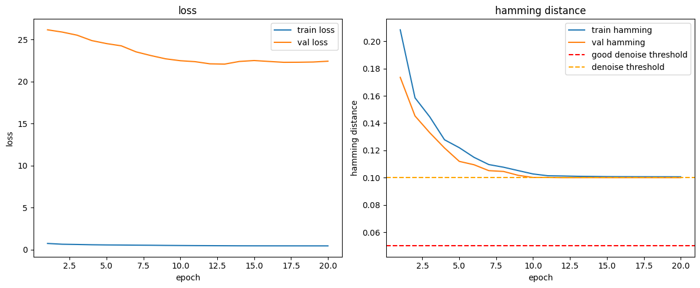

# Autoencoder for Denoising *k*-mers in Genomic Sequences

This project implements a neural autoencoder to denoise genomic *k*-mers extracted from the _Escherichia coli_ genome.
The autoencoder learns to reconstruct clean *k*-mers from noisy input sequences, aiming to improve the quality of sequence data for downstream applications such as genome assembly by De-Bruijn graphs and variant detection.

## Key Features
- Downloads and parses _E. coli_ genome data from NCBI.
- Extracts *k*-mers and introduces synthetic salt-and-pepper-ish noise.
- Converts *k*-mers to one-hot encoded tensors.
- Defines and trains a neural autoencoder using PyTorch.
- Evaluates performance with Hamming distance.

## Precautions
- Please read this with a more or less critical eye, as this is my first time using NN architecture. 

## Usage
1. Install dependencies:
```bash
pip install torch torchvision scikit-learn biopython matplotlib
```

2. Run the provided script to:
   - Download genome data
   - Prepare noisy and clean *k*-mers
   - Train the autoencoder for several epochs
   - Observe training and validation metrics

## Notes
- Uses CUDA if available for acceleration (definitely should).
- You should check which CUDA version you'll need.
- .. good luck finding out what to do if you're using another GPU (probably _ROCm_ for AMD GPUs and _oneAPI_ for Intel GPUs, both of which seem not to be integrated in PyTorch's main API).
- Also you may need to get yourself some few additional RAM banks or explicitly decrease the `subset_fraction`, since the current `subset_fraction` yields an amount of *k*-mers of around _1e7_ (times (k=31) in nucleotides) for both current Escherichia coli strains — 32GB DDR4/DDR5 should suffice for a clean runthrough of the *k*-mers construction. Of course you can try with 16GB RAM, but expect some level of storage degradation if you run this a few million times.
- Suitable for experimentation with sequence denoising techniques.
- .. and I just started writing this so i still have to figure out the right architecture tweaks.

## What's next?
- [X] Incorporate _Escherichia coli_ variants. (at least semi ticked)
- [ ] To explore broader applicability, maybe extend the repository to more complex organisms that can inherit and maintain low-frequency variants — such as somatic mutations in multicellular eukaryotes.
- [ ] .. and add like 5 more RAM banks, because holy shit.
- [ ] and actually chieve a true denoising effect. I imagine the loss landscape as a vast, rugged terrain with a broad, smooth plane sitting beneath the noise floor. If we think of this noise floor as a plastic dartboard with tiny holes, correcting a single nucleotide is like aiming for one specific tiny hole, rather than targeting the sections on the board. The challenge is to navigate this landscape and somehow precisely land in that small, elusive holes.

## Previous training progress
The plots below show the decrease in validation Hamming distance of the model trained using binary cross-entropy with logits loss.
The Hamming distance that is reached by convergence however reflects the inserted error amount, so it seems not to really learn as of yet.


